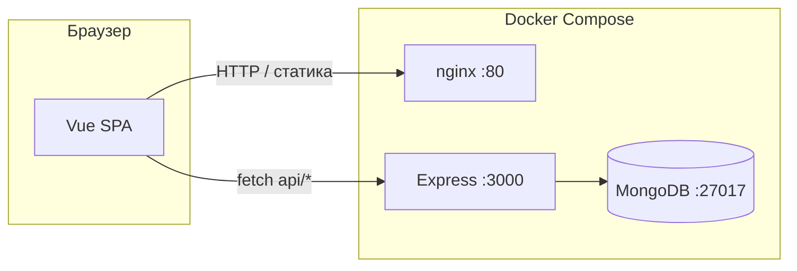

# Web-проект (Vue + Express + MongoDB)

Монорепозиторий с клиентом на **Vue 3** (Vite, TypeScript), сервером на **Express** и базой **MongoDB**. Сборка фронтенда отдаётся через **nginx**; API префикс `/api`.

---

## Архитектура



- **Клиент**: одностраничное приложение (SPA), маршрутизация на стороне браузера (`vue-router`).
- **Сервер**: REST API под префиксом `/api`, данные в MongoDB через Mongoose.
- **nginx**: раздаёт статику из `client/dist`, пробрасывает **`/api/`** на бэкенд, для остальных путей SPA отдаёт `index.html` (чтобы при обновлении `/pets`, `/calendar` не было 404).

---

## Структура репозитория

### Корень (`/`)

| Путь | Назначение |
|------|------------|
| `docker-compose.yml` | Оркестрация: MongoDB, backend, frontend (nginx). Общая сеть и том для данных MongoDB. |
| `.gitignore` | Игнорирование `node_modules`, `.env`, сборок, IDE и т.д. для всего репозитория. |

Корневого `package.json` нет — **client** и **server** живут как отдельные Node-проекты.

---

### Клиент (`/client`)

Клиентское приложение на **Vue 3 + TypeScript**, сборщик **Vite**.

| Путь | Назначение |
|------|------------|
| `package.json` / `package-lock.json` | Зависимости и скрипты npm (`dev`, `build`, `preview`). |
| `vite.config.ts` | Конфиг Vite: плагин Vue, алиас `@` → `src`. |
| `tsconfig*.json` | Настройки TypeScript для приложения и Node-утилит. |
| `index.html` | Точка входа Vite, подключение `main.ts`. |
| **Docker** |
| `Dockerfile` | Многостадийная сборка: `npm install` → `npm run build` → образ **nginx** со статикой. |
| `nginx/default.conf` | SPA `try_files` и проброс **`/api/`** на контейнер `server:3000` в Compose. |
| `.dockerignore` | Что не копировать в контекст сборки Docker. |
| **Публичные файлы** |
| `public/` | Статика без обработки Vite (favicon, svg и т.д.), попадает в корень `dist`. |
| **Исходники `src/`** |
| `src/main.ts` | Инициализация приложения, подключение роутера и глобальных стилей. |
| `src/App.vue` | Корневой layout / оболочка приложения. |
| `src/style.css` | Глобальные стили. |
| `src/router/index.ts` | Маршруты (`/`, `/pets`, `/calendar`), `createWebHistory`. |
| `src/components/` | Страничные компоненты (`Container.vue`, `Calendar.vue`). |
| `src/components/UI/` | Переиспользуемый UI, в т.ч. `CalendarGrid.vue` (сетка календаря), кнопки, инпуты, `SegmentedProgressRing`, модалки. |
| `src/types/` | TypeScript-типы и константы по доменам (`pets`, `calendar`). |
| `src/utils/requests/` | Обёртки `fetch` для GET/POST/PUT/DELETE к API (в коде задан базовый URL бэкенда). |
| `src/directives/` | Директивы Vue (например маска ввода для полей даты/телефона). |
| `src/assets/` | Ресурсы, импортируемые из кода (иконки SVG и т.д.). |

---

### Сервер (`/server`)

Backend на **Express + Mongoose (MongoDB)**.

| Путь | Назначение |
|------|------------|
| `package.json` / `package-lock.json` | Зависимости: express, cors, mongoose, dev: ts-node, nodemon, typescript. |
| `tsconfig.json` | Компиляция TypeScript в `dist/` для `npm start`. |
| **Docker** |
| `Dockerfile` | Образ Node (Alpine): установка зависимостей, копирование кода, запуск через `ts-node` (как в текущем файле). |
| `.dockerignore` | Исключения для контекста сборки. |
| **Исходники `src/`** |
| `src/app.ts` | Создание Express-приложения, CORS, `express.json()`, монтирование роутера на `/api`, подключение к MongoDB, `listen`. |
| `src/routers/router.ts` | Маршруты: питомцы (`/pets`, `/pet`…), календарь (`/calendar`). |
| `src/controllers/` | Обработчики HTTP: получение тела запроса и вызов сервисов. |
| `src/services/` | Бизнес-логика и работа с моделями Mongoose. |
| `src/schemas/` | Схемы и модели Mongoose: питомцы, календарь привычек. |

Паттерн **controller → service → schema/model** упрощает тестирование и изменение хранения данных.

---

## Переменные окружения (сервер)

| Переменная | Описание | Пример (локально) |
|------------|----------|-------------------|
| `PORT` | Порт HTTP-сервера | `3000` |
| `MONGODB_URI` | Строка подключения MongoDB | `mongodb://localhost:27017/mydatabase` или URI с логином (см. `docker-compose`) |

Для Docker значения задаются в `docker-compose.yml` у сервиса `server`.

---

## Как запускать

### Вариант 1: Docker Compose (рекомендуется для «как в проде»)

Требования: **Docker** и **Docker Compose**.

```bash
docker compose up -d --build
```

- Фронтенд: **http://localhost** (порт **80**)
- API: **http://localhost:3000**
- MongoDB: порт **27017** (на хосте)

Остановка:

```bash
docker compose down
```

Данные MongoDB сохраняются в именованном томе `mongodb_data`.

---

### Вариант 2: Локальная разработка (без Docker)

1. Запустите **MongoDB** (локально или контейнер только с БД).

2. **Сервер** (из папки `server/`):

```bash
cd server
npm install
export PORT=3000
export MONGODB_URI=mongodb://127.0.0.1:27017/mydatabase
npm run dev
```

3. **Клиент** (из папки `client/`):

```bash
cd client
npm install
npm run dev
```

Vite по умолчанию поднимет dev-сервер (часто `http://localhost:5173`). Для календаря и при необходимости других страниц включён proxy: запросы с dev-сервера на `/api/**` пробрасываются на Express (`localhost:3000`). Запросы из браузера в `utils/requests` всё так же могут ходить на `http://localhost:3000` напрямую (как у питомцев).

Сборка клиента для проверки production-артефакта:

```bash
cd client
npm run build   # результат в client/dist
```

---

## API (кратко)

Префикс у роутера в коде: **`/api`** (см. `server/src/app.ts`).

| Метод | Путь | Назначение |
|-------|------|------------|
| GET | `/api/pets` | Список питомцев |
| POST | `/api/pet` | Создание |
| PUT | `/api/pet/:id` | Обновление |
| DELETE | `/api/pet/:id` | Удаление |
| GET | `/api/calendar?month=YYYY-MM` | Записи календаря привычек за месяц |
| POST | `/api/calendar` | Создание или обновление записи по дню (`date`, `alcohol`, `cigarettes`, `sugar`) |
| POST | `/api/login` | Проверка login и password |
| POST | `/api/verify` | Проверка 4-х значного кода |

--- 

## Создание пользователя для страницы входа для сотрудников

Для начала подключимся к бд

```bash

# Подключение к монго
docker-compose exec mongodb mongosh -u admin -p admin123 --authenticationDatabase admin

# Вводим и проверяем нет ли пользователя
show dbs
use mydatabase
db.users.find()
exit

```

Далее создадим пользователя если его нет

```bash

# Открываем shell внутри контейнера с беком
docker-compose exec server sh

# Внутри запускаем контейнер
npm run create-test-user

```